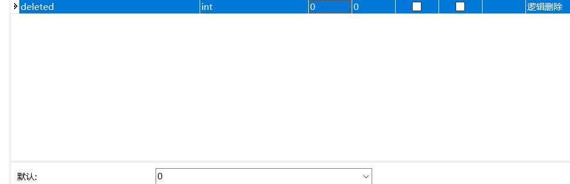

# MybatisPlus

# 一、简介

MyBatis-Plus (opens new window)（简称 MP）是一个 MyBatis (opens new window)的增强工具，在 MyBatis 的基础上只做增强不做改变，为简化开发、提高效率而生。

愿景

官网：https://baomidou.com/


> 特性

- **无侵入**：只做增强不做改变，引入它不会对现有工程产生影响，如丝般顺滑
- **损耗小**：启动即会自动注入基本 CURD，性能基本无损耗，直接面向对象操作
- **强大的 CRUD 操作**：内置通用 Mapper、通用 Service，仅仅通过少量配置即可实现单表大部分 CRUD 操作，更有强大的条件构造器，满足各类使用需求
- **支持 Lambda 形式调用**：通过 Lambda 表达式，方便的编写各类查询条件，无需再担心字段写错
- **支持主键自动生成**：支持多达 4 种主键策略（内含分布式唯一 ID 生成器 - Sequence），可自由配置，完美解决主键问题
- **支持 ActiveRecord 模式**：支持 ActiveRecord 形式调用，实体类只需继承 Model 类即可进行强大的 CRUD 操作
- **支持自定义全局通用操作**：支持全局通用方法注入（ Write once, use anywhere ）
- **内置代码生成器**：采用代码或者 Maven 插件可快速生成 Mapper 、 Model 、 Service 、 Controller 层代码，支持模板引擎，更有超多自定义配置等您来使用
- **内置分页插件**：基于 MyBatis 物理分页，开发者无需关心具体操作，配置好插件之后，写分页等同于普通 List 查询
- **分页插件支持多种数据库**：支持 MySQL、MariaDB、Oracle、DB2、H2、HSQL、SQLite、Postgre、SQLServer 等多种数据库
- **内置性能分析插件**：可输出 Sql 语句以及其执行时间，建议开发测试时启用该功能，能快速揪出慢查询
- **内置全局拦截插件**：提供全表 delete 、 update 操作智能分析阻断，也可自定义拦截规则，预防误操作

# 二、快速入门

> 步骤

1. 创建数据库`mybatis_plus`

2. 创建user表并插入数据

   ```sql
   DROP TABLE IF EXISTS user;
   
   CREATE TABLE user
   (
   	id BIGINT(20) NOT NULL COMMENT '主键ID',
   	name VARCHAR(30) NULL DEFAULT NULL COMMENT '姓名',
   	age INT(11) NULL DEFAULT NULL COMMENT '年龄',
   	email VARCHAR(50) NULL DEFAULT NULL COMMENT '邮箱',
   	PRIMARY KEY (id)
   );
   DELETE FROM user;
   
   INSERT INTO user (id, name, age, email) VALUES
   (1, 'Jone', 18, 'test1@baomidou.com'),
   (2, 'Jack', 20, 'test2@baomidou.com'),
   (3, 'Tom', 28, 'test3@baomidou.com'),
   (4, 'Sandy', 21, 'test4@baomidou.com'),
   (5, 'Billie', 24, 'test5@baomidou.com');
   -- 真实开发中 version(乐观锁)、deleted(逻辑删除)、gmt_create、gmt_modified
   ```

3. 编写项目——初始化项目！使用Springboot初始化

4. 导入依赖

   ```xml
   <!--        数据库驱动-->
   <dependency>
       <groupId>mysql</groupId>
       <artifactId>mysql-connector-java</artifactId>
       <version>8.0.22</version>
   </dependency>
   <!--        lombok-->
   <dependency>
       <groupId>org.projectlombok</groupId>
       <artifactId>lombok</artifactId>
       <version>1.18.18</version>
   </dependency>
   <!--        mybatis-plus-->
   <dependency>
       <groupId>com.baomidou</groupId>
       <artifactId>mybatis-plus-boot-starter</artifactId>
       <version>3.0.5</version>
   </dependency>
   ```

5. 连接数据库

   ```properties
   #mysql 5 驱动不同 com.mysql.jdbc.Driver
   
   #mysql 8 驱动不同com.mysql.cj.jdbc.Driver 需要增加时区的配置 serverTimezone=GMT%2B8
   spring.datasource.username=root
   spring.datasource.password=123456
   spring.datasource.url=jdbc:mysql://localhost:3306/mybatis_plus?characterEncoding=utf-8&serverTimezone=GMT%2B8
   spring.datasource.driver-class-name=com.mysql.cj.jdbc.Driver
   ```

6. 使用mybatis-plus的操作

   - pojo

     ```java
     package com.kuang.pojo;
     
     import lombok.AllArgsConstructor;
     import lombok.Data;
     import lombok.NoArgsConstructor;
     
     /**
      * @ClassName User
      * @Description TODO
      * @Author Lambert
      * @Date 2021/4/26 11:29
      * @Version 1.0
      **/
     @Data
     @AllArgsConstructor
     @NoArgsConstructor
     public class User {
         private Long id;
     
         private String name;
     
         private Integer age;
     
         private String email;
     }
     ```

   - mapper接口 

     ```java
     package com.kuang.mapper;
     
     import com.baomidou.mybatisplus.core.mapper.BaseMapper;
     import com.kuang.pojo.User;
     import org.springframework.stereotype.Repository;
     
     /**
      *
      * MybatisPlus能在Mapper上面实现基本的接口
      * Mapper继承BaseMapper
      *
      * @ClassName UserMapper
      * @Description TODO
      * @Author Lambert
      * @Date 2021/4/26 11:32
      * @Version 1.0
      **/
     @Repository //持久层
     public interface UserMapper extends BaseMapper<User> {
         //所有的CRUD操作已经编写完成了
     }
     ```

   - 使用前要在MybatisPlusApplication类上加上扫描mapper的注解

     ```java
     //扫描mapper文件夹
     @MapperScan("com.kuang.mapper")
     @SpringBootApplication
     public class MybatisPlusApplication {
         public static void main(String[] args) {
             SpringApplication.run(MybatisPlusApplication.class, args);
         }
     }
     ```

   - 使用

     ```java
     @SpringBootTest
     class MybatisPlusApplicationTests {
     
         /**
          * 继承了BaseMapper，所有的方法都来自父类
          * 同时可以编写自己的扩展方法
          */
         @Autowired
         private UserMapper userMapper;
     
         @Test
         void contextLoads() {
             /**
              * 查询全部用户
              * 参数是一个Wrapper，条件构造器
              */
             List<User> users = userMapper.selectList(null);
             users.forEach(System.out::println);
     
         }
     }
     ```

   - 结果

# 三、配置日志

```properties
#日志配置
mybatis-plus.configuration.log-impl=org.apache.ibatis.logging.stdout.StdOutImpl
```


# 四、CRUD扩展

## 1、Insert插入

```java
//测试插入功能
@Test
public void testInsert(){
    User user = new User();
    user.setName("java");
    user.setAge(18);
    user.setEmail("2473758409");
    int result = userMapper.insert(user);//能自动生成id（雪花算法）
    System.out.println(result);
    System.out.println(user);
}
```


> 数据库插入的id的默认值为：全局的唯一id

## 2、主键生成策略

> 默认ID_WORKER全局唯一id

分布式系统唯一id生成：https://www.cnblogs.com/haoxinyue/p/5208136.html

1. uuid

2. 自增id

   - 在实体类字段上添加`@TableId(type = IdType.AUTO)`

     ```java
         @TableId(type = IdType.AUTO)
         private Long id;
     ```

   - 数据库字段上设置自增

   - 再次测试插入

     

3. **雪花算法**

   snowflake是Twitter开源的分布式ID生成算法，结果是一个long型的ID。其核心思想是：使用41bit作为毫秒数，10bit作为机器的ID（5个bit是数据中心，5个bit的机器ID），12bit作为毫秒内的流水号（意味着每个节点在每毫秒可以产生 4096 个 ID），最后还有一个符号位，永远是0

4. redis

5. zookepper

> 其余的IdType源码解释

```java
public enum IdType {
    AUTO(0),//数据库id自增
    NONE(1),//未设置主键
    INPUT(2),//手动输入
    ID_WORKER(3),//默认的19位全局id（类型为Long）
    UUID(4),//全局唯一id
    ID_WORKER_STR(5);//ID_WORKER的字符串类型表示
}
```

- 手动输入INPUT

  ```java
  @TableId(type = IdType.INPUT)
  private Long id;
  ```

  ```java
  User user = new User();
  user.setId(6l);
  ```

## 3、update更新

```java
@Test
public void testUpdate(){
    User user = new User();
    user.setId(6L);
    user.setEmail("2473758409@qq.com");
    //updateById参数是一个对象
    userMapper.updateById(user);
}
```


所有的sql都是自动动态配置

## 4、自动填充

> 创建时间、修改时间都希望操作一遍就自动化地完成

阿里巴巴开发手册：所有地数据库表：gmt_create、gmt_modified、几乎所有的表都要配置上，而且需要自动化

### 4.1 数据库级别

- 在表中新增字段create_time，update_time

  

  update_time每次修改后需要重新定义更新时间 

- 再次测试插入方法

  pojo添加属性

  ```java
  private Date createTime;
  private Date updateTime;
  ```

  重新插入一条新字段以及修改id为6的的数据后：

  

### 4.2 代码级别

- 删除数据库的默认值、更新操作

  

- 实体类字段属性上添加注解

  ```java
  //字段添加填充内容
  @TableField(fill = FieldFill.INSERT)
  private Date createTime;
  
  @TableField(fill = FieldFill.INSERT_UPDATE)
  private Date updateTime;
  ```

- 编写处理器来处理这个注解

  ```java
  package com.kuang.handle;
  
  import com.baomidou.mybatisplus.core.handlers.MetaObjectHandler;
  import lombok.extern.slf4j.Slf4j;
  import org.apache.ibatis.reflection.MetaObject;
  import org.springframework.stereotype.Component;
  
  import java.util.Date;
  
  /**
   * @ClassName MyMetObjectHandler
   * @Description TODO
   * @Author Lambert
   * @Date 2021/4/26 13:51
   * @Version 1.0
   **/
  @Component//一定要将处理器加到IOC容器中
  @Slf4j
  public class MyMetObjectHandler implements MetaObjectHandler {
  
      //使用mp实现插入时这个方法会执行
      @Override
      public void insertFill(MetaObject metaObject) {
          //default MetaObjectHandler setFieldValByName(String fieldName, Object fieldVal, MetaObject metaObject)
          log.info("start insert fill....");
  
          this.setFieldValByName("createTime",new Date(),metaObject);
          this.setFieldValByName("updateTime",new Date(),metaObject);
  
      }
  
      //使用mp实现修改时这个方法会执行
      @Override
      public void updateFill(MetaObject metaObject) {
          log.info("start update  fill....");
          this.setFieldValByName("updateTime",new Date(),metaObject);
      }
  }
  ```

- 测试插入

- 测试更新、观察时间

## 5、乐观锁

> 乐观锁：它总是认为不会出现问题，无论干什么都不去上锁！如果出现了问题就再次更新值测试
>
> 悲观锁：它总是认为会出现问题，无论干什么都会上锁！再去操作！

当要更新一条记录的时候，希望这条记录没有被别人更新
乐观锁实现方式：

- 取出记录时，获取当前version
- 更新时，带上这个version
- 执行更新时， set version = newVersion where version = oldVersion
- 如果version不对，就更新失败

```sql
乐观锁：1、先查询，获得版本号 version = 1
--A
update user set name = "kuangshen",version = version + 1
where id = 2 and version = 1
--B 若线程B抢先完成，这个时候version = 2 会导致A修改失败
update user set name = "kuangshen",version = version + 1
where id = 2 and version = 1
```

> 测试MP的乐观锁插件

- 给数据库增加version字段

   

  所有的version字段的值都是1

- 给实体类加对应的字段

  ```java
  @Version	//代表这是一个乐观锁
  private Integer version;
  ```

- 注册组件

  ```java
  package com.kuang.config;
  
  import com.baomidou.mybatisplus.extension.plugins.MybatisPlusInterceptor;
  import com.baomidou.mybatisplus.extension.plugins.inner.OptimisticLockerInnerInterceptor;
  import org.mybatis.spring.annotation.MapperScan;
  import org.springframework.context.annotation.Bean;
  import org.springframework.context.annotation.Configuration;
  import org.springframework.transaction.annotation.EnableTransactionManagement;
  
  /**
   * @ClassName MybatisPlusConfig
   * @Description TODO
   * @Author Lambert
   * @Date 2021/4/27 15:14
   * @Version 1.0
   **/
  //扫描mapper文件夹 
  @MapperScan("com.kuang.mapper")
  @Configuration  //配置类
  @EnableTransactionManagement
  public class MybatisPlusConfig {
      /**
       * 注册乐观锁插件
       */
      @Bean
      public MybatisPlusInterceptor mybatisPlusInterceptor() {
          MybatisPlusInterceptor mybatisPlusInterceptor = new MybatisPlusInterceptor();
          mybatisPlusInterceptor.addInnerInterceptor(new OptimisticLockerInnerInterceptor());
          return mybatisPlusInterceptor;
      }
  }
  ```

- 测试

  ```java
  	/**
       * 测试乐观锁
       */
  @Test
  public void testOptimisticLocker(){
      //1、查询用户信息
      User user = userMapper.selectById(1L);
      //2、修改用户信息
      user.setName("kuangshen");
      user.setEmail("2473758409@qq.com");
      //3、执行更新操作
      userMapper.updateById(user);
  }
  ```

  

  ```java
  	/**
       * 测试乐观锁失败!多线程下
       */
  @Test
  public void testOptimisticLocker2(){
      //线程一
      User user = userMapper.selectById(1L);
      user.setName("kuangshen111");
      user.setEmail("2473758409@qq.com");
  
      //线程二 模拟另一个线程插队操作
      User user2 = userMapper.selectById(1L);
      user2.setName("kuangshen222");
      user2.setEmail("2473758409@qq.com");
  
      userMapper.updateById(user2);
  
      userMapper.updateById(user);//如果没有乐观锁就会覆盖插队线程的值
  }
  ```

  加了乐观锁后线程一操作失败了

  


## 6、查询操作

### 6.1 查询单个用户

```java
	/**
     * 测试查询
     */
@Test
public void testSelectById(){
    User user = userMapper.selectById(1l);
    System.out.println(user);
}
```

### 6.2 查询多个用户

```java
    /**
     * 测试批量查询
     */
@Test
public void testSelectById(){
    List<User> users = userMapper.selectBatchIds(Arrays.asList(1, 2, 3));
    System.out.println(users);
}
```

### 6.3 条件查询 

```java
/**
 * 按条件查询之一：map
 */
@Test
public void testSelectByMap(){
    HashMap<String, Object> map = new HashMap<>();
    //自定义查询的条件
    map.put("name", "java");
    map.put("age", 30);
    List<User> users = userMapper.selectByMap(map);
    users.forEach(System.out::println);
}
```

## 7、分页查询

- limit进行分页
- pageHelper第三方插件分页
- MP页内置了分页插件

> 使用

- 配置拦截器组件

  ```java
  //扫描mapper文件夹
  @MapperScan("com.kuang.mapper")
  @Configuration  //配置类
  public class MybatisPlusConfig {
      /**
       * 注册插件
       */
      @Bean
      public MybatisPlusInterceptor mybatisPlusInterceptor() {
          MybatisPlusInterceptor mybatisPlusInterceptor = new MybatisPlusInterceptor();
          //乐观锁插件
          mybatisPlusInterceptor.addInnerInterceptor(new OptimisticLockerInnerInterceptor());
          //分页插件
          mybatisPlusInterceptor.addInnerInterceptor(new PaginationInnerInterceptor(DbType.H2));
          return mybatisPlusInterceptor;
      }
  
  }
  ```

- 直接使用Page对象

  ```java
  /**
   * 测试分页查询
   */
  @Test
  public void testPage(){
      //参数一 当前页
      //参数二 页面大小
      Page<User> page = new Page<>(4,2);
      userMapper.selectPage(page,null);
  
      page.getRecords().forEach(System.out::println);
      //page.getCurrent();//获取当前页
      //page.getRecords()；//每页数据的list集合
      //page.getSize();//每页记录数量
      //page.getTotal();//所有页加起来的总记录数
      //page.getPages();//总页数	
      //page.hasNext();//是否有上一页
      //page.hasPrevious()//是否有下一页
  }
  ```

##  8、删除操作

### 8.1 根据id删除记录

```java
    /**
     * 根据id删除记录
     */
@Test
public void testDeleteById(){
    userMapper.deleteById(1386535050027216897L);
}
```

### 8.2 根据id批量删除

```java
/**
 * 通过id批量删除
 */
@Test
public void testDeleteBatchIds(){
  userMapper.deleteBatchIds(Arrays.asList(1386535476197949442l,1386555943751286786l,1386560421682511874l));
}
```

### 8.3 根据map删除

```java
    /**
    * 通过map删除
     */
@Test
public void testDeleteByMap(){
    HashMap<String, Object> map = new HashMap<>();
    map.put("name", "Jack");
    userMapper.deleteByMap(map);
}
```

## 9、逻辑删除

> 物理删除：从数据库中直接移除	
>
> 逻辑删除：在数据库中没有被移除，而是通过变量来让他失效 delete = 1

管理员可以查看被删除的记录 防止数据丢失 类似于回收站

测试

-  在数据表中增加一个deleted字段

  

- 在实体类中增加属性

  ```java
  @TableLogic//逻辑删除
  private Integer deleted;
  ```

- ```properties
  #配置逻辑删除
  mybatis-plus.global-config.db-config.logic-delete-value=1
  mybatis-plus.global-config.db-config.logic-not-delete-value=0
  ```

- 删除某一条数据后：会将该条数据的deleted改为1表示已删除

  

- 并且查询方法查不到deleted=1的用户

  

# 五、性能分析插件

> 官方已删除该插件


# 六、条件构造器

> Wrapper（复杂sql）


- 测试一：查询name和邮箱不为空的用户，年龄大于等于12岁

  ```java
  @Test
  void contextLoads() {
      //查询name和邮箱不为空的用户，年龄大于等于12岁
      QueryWrapper<User> wrapper = new QueryWrapper<>();
      wrapper
              .isNotNull("name")
              .isNotNull("email")
              .ge("age", 12);
      userMapper.selectList(wrapper).forEach(System.out::println);//
  }
  ```

- 测试二：查询name为Tom的数据

  ```java
  @Test
  void test2(){
      //查询name为Tom的数据
      QueryWrapper<User> wrapper = new QueryWrapper<>();
      wrapper.
          eq("name", "Tom");
      User user = userMapper.selectOne(wrapper);
      System.out.println(user);
  }
  ```

- 测试三：查询年龄在20~30岁之间的用户数量

  ```java
  @Test
  void test3(){
      //查询年龄在20~30岁之间的用户数量
      QueryWrapper<User> wrapper = new QueryWrapper<>();
      wrapper.between("age", 20, 30);
      System.out.println(userMapper.selectCount(wrapper));
  }
  ```

- 测试四：名字不包含e且邮箱以t开头

  ```java
  @Test
  void test4(){
      //模糊查询
      QueryWrapper<User> wrapper = new QueryWrapper<>();
      //likeLeft/Right  %e  e%
      //名字不包含e且邮箱以t开头
      wrapper
          .notLike("name", "e")
          .likeRight("email", "t");
  
      List<Map<String, Object>> maps = userMapper.selectMaps(wrapper);
      maps.forEach(System.out::println);
  }
  ```

- 测试五：子查询 id在子查询中查出来

  ```java
  @Test
  void test5(){
      QueryWrapper<User> wrapper = new QueryWrapper<>();
      //id在子查询中查出来
      wrapper.inSql("id", "select id from user where id<5");
      List<User> userList = userMapper.selectList(wrapper);
      userList.forEach(System.out::println);
  }
  ```

- 测试六：排序  通过id进行排序  Desc降序 Asc升序

  ```java
  @Test
  void test6(){
      QueryWrapper<User> wrapper = new QueryWrapper<>();
      //通过id进行排序  Desc降序 Asc升序
      wrapper.orderByDesc("id");
      List<User> userList = userMapper.selectList(wrapper);
      userList.forEach(System.out::println);
  }
  ```

# 七、代码自动生成器

AutoGenerator 是 MyBatis-Plus 的代码生成器，通过 AutoGenerator 可以快速生成 Entity、Mapper、Mapper XML、Service、Controller 等各个模块的代码，极大的提升了开发效率。

